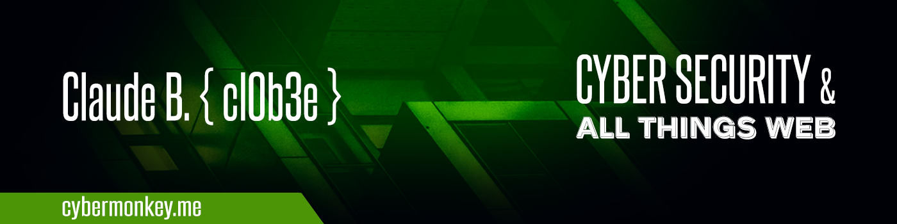

<div align="center">"What I do have are a very particular set of skills. Skills I have acquired over many long nights spent geeking out." - Liam Neeson (and myself)</div>

---



[](https://cybermonkey.me)
[](https://www.linkedin.com/in/clobee/)
[](https://tryhackme.com/p/clobee)
[](https://app.hackthebox.eu/profile/422272)


### Hi there <a href="https://cybermonkey.me"></a>


<p><b>🦾 DevSecOps | Senior software engineer (Back-end)</b></p>

🎓 **Sec Certs** : Linux+ | Cloud+ | Security+ | Pentest+ | ejPT | eCPPT | CEH Master | OSCP (wip)

<!--START_SECTION:badges-->
<!--END_SECTION:badges-->

📟 **Other Certs** : AWS (wip) | Azure (wip)

🔥 In love with quality code (and my terminal :D) 🔥

💡 Learn, 💻 Code, 🏝️ Travel and Repeat 🔁

<p>
Passionate DevSecOps Engineer<br/>
I have a diverse range of experience in the web industry, having fulfilled a variety of roles all with the goal of delivering value to end users. 
<br/><br/>
I am currently working on fixing broken pipelines<br/>
ensuring that my Agile team mates have everything they need to ship code.<br/>
I also occasionally work on PHP platforms using the Symfony Framework.<br/>
In addition, I am also shipping Python and Bash;<br/>
making sure I keep up with the security world
</p>

```python
class ComputerGuy:
  def __init__(self, speciality, languages):
    self.speciality = speciality
    self.languages = languages

langs = ["PHP", "Python", "Bash"]
dev = ComputerGuy("backend", langs)

print(dev.speciality)
print(dev.languages[1])
```


### GitHub Stats 📈

<div align="center">
  <table width="100%">
    <tbody>
      <tr>
        <td width="50%" style="border: none !important;">
        <div align="center" width="100%">
          <a href="https://github.com/clobee">
            
          </a>
        </div>
        </td>
        <td width="50%" style="border: none !important;">
        <div align="center" width="100%">
          <a href="https://github.com/clobee">
            
          </a>
        </div>
        </td>
      </tr>
    </tbody>
  <table>
<div>


